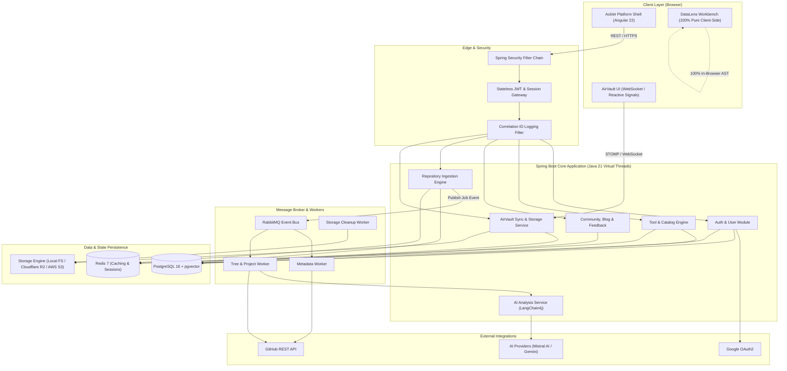
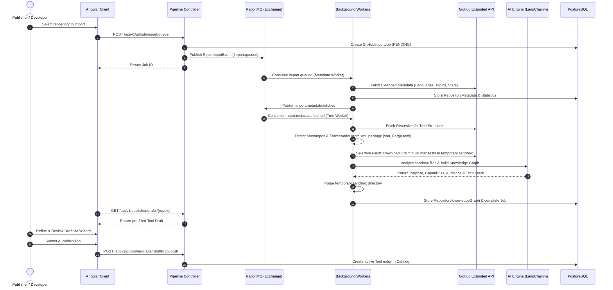

# Acklet

> **Everyday digital problems deserve fast, dedicated tools.**

Acklet is a developer-centric utilities and tools platform designed to replace ad-heavy, fragmented web utilities with high-performance, privacy-conscious tools. By combining standalone, client-side execution utilities with a centralized discovery hub, cloud synchronization, and an automated GitHub-driven repository analysis pipeline, Acklet provides software engineers, DevOps specialists, and builders with a single, cohesive workspace to solve digital tasks without friction.

---

## Overview

### What is Acklet?
Acklet is a modern digital platform designed for discovering, running, and publishing specialized developer utilities. Instead of navigating dozens of cluttered web utilities burdened with invasive trackers, intrusive ads, and opaque backend processing, Acklet delivers purpose-built utilities that run instantly in the browser alongside real-time synchronization, community workflows, and repository-to-tool publishing pipelines.

### Who is it for?
- **Software Engineers & DevOps Professionals:** Who need quick, reliable data manipulation, formatting, inspection, and cross-device payload handoffs.
- **Tool Authors & Open-Source Creators:** Who build single-purpose utilities and want an automated discovery, AI-assisted packaging, and publishing pipeline directly from their GitHub repositories.
- **Development Teams:** Who require shared workspaces, encrypted cross-device synchronization, and centralized tool discovery without data leakage.

### Why it exists
Most online developer utilities suffer from one of three flaws:
1. **Privacy Concerns:** Data payloads (JSON, JWTs, configuration tokens) are transmitted to opaque third-party backends.
2. **Poor UX and Clutter:** Tool pages are overwhelmed with display ads, slow runtimes, and rigid UI templates.
3. **Distribution Friction:** Authors building helpful utilities lack a streamlined distribution channel with integrated analytics, categorization, and feedback mechanisms.

Acklet solves this by establishing a clear distinction: **Acklet provides the platform identity and infrastructure; each tool owns its signature user experience and local processing.**

### Core Product Philosophy
- **100% Client-Side Privacy First:** Client tools execute transformations, AST manipulations, and parsing directly in the browser runtime (Web Workers, TypeScript, WASM) without transmitting user payloads to remote servers.
- **Tool Isolation & Unique Signature UX:** Each tool features an interface tailored specifically to its interaction model and information density (dense editors for data tools, tactile controls for sync utilities), rather than forcing monolithic templates.
- **Privacy-Preserving Repository Ingestion:** When analyzing codebases to generate tool listings, Acklet avoids permanently holding entire codebases. It fetches metadata, structural Git trees, and specific build manifests on-demand, executing AI analysis in ephemeral sandboxes that are immediately purged.

---

## Key Features

The Acklet platform is divided into two functional domains: **Platform Ecosystem Services** and **Standalone Built-in Tools**. All features listed below are implemented in the repository.

### 1. Platform & Ecosystem Capabilities

- **Intelligent Discovery & Catalog:**
  - Categorized tool directory (`/tools/explore`, `/tools/categories`) with search indexing.
  - Dynamic sorting by trending activity, featured utilities, and new releases.
  - Omnisearch query engine with autocomplete and direct keyboard shortcuts.

- **GitHub Repository Ingestion & Tool Publishing Pipeline:**
  - **OAuth Integration:** Secure GitHub account linking with encrypted token persistence.
  - **Asynchronous Processing via RabbitMQ:** Multi-stage background worker pipeline decoupled from HTTP requests.
  - **Selective Manifest Ingestion:** Analyzes remote Git trees to fetch only configuration and manifest files (`package.json`, `pom.xml`, `Cargo.toml`, `Dockerfile`) without cloning entire repositories.
  - **AI-Driven Knowledge Graph Extraction:** Generates structured metadata, capability lists, target audience summaries, and SEO descriptions via LangChain4j integration (Mistral AI / Google Gemini).
  - **Interactive Multi-Step Publish Wizard:** In-progress auto-saving draft system with Server-Sent Events (SSE) real-time pipeline status streaming.

- **User Accounts, Security & Workspaces:**
  - Email/password authentication with BCrypt hashing and email OTP validation.
  - Google OAuth2 authentication flow.
  - Stateless JWT access tokens with rotating enterprise refresh tokens and revocation lists.
  - Per-user dashboard (`/workspace`) managing starred favorites, execution history, personal tool drafts, and notifications.
  - Custom user collections (public and private tool playlists).

- **Community & Platform Feedback:**
  - Community discussion boards (`/community/discussions`) with threaded hierarchical replies.
  - Platform-wide Unified Feedback System supporting bug reports, feature suggestions, and NPS ratings.
  - Technical article hub and blog with reading time estimation (`/blog`).

---

### 2. Standalone Built-in Tools

#### DataLens — Multi-Format Data Workbench & Validator
*Location:* `client/src/tools/data-lens/` | *Route:* `/tools/app/datalens`

- **Multi-Format Processing:** Real-time formatting, minification, conversion, and structural validation across **JSON, YAML, XML, CSV, TOML, and cURL**.
- **100% Client-Side Security:** Zero network transmission of data payloads with an active interactive privacy badge indicator.
- **Deep Structural Diagnostics:** Pinpoints syntax errors to exact `Line X · Column Y` coordinates with context snippets, human explanations, and 1-click smart auto-repair for common syntax errors.
- **Data Inspection Views:** Interactive AST tree viewer with node path copying, tabular matrix rendering for array collections, statistical schema analysis, and payload diffing.
- **Code Generation:** Converts structured data into typed model definitions for TypeScript, Go structs, Python dataclasses, Java records, Rust structs, and Kotlin data classes.
- **Local Persistence:** Client-side IndexedDB snapshot storage with full search, chronological grouping, and 1-click purge.

#### AirVault — Cross-Device Real-Time Sync & Clipboard Platform
*Location:* `client/src/tools/airvault/` & `server/acklet/src/main/java/com/code/acklet/airvault/` | *Route:* `/tools/app/airvault`

- **Multi-Type Content Handoff:** Real-time synchronization of raw text, code snippets, hyperlinks, images, and binary attachments.
- **Ephemeral & Persistent Workspaces:** Supports both anonymous temporary code-paired sessions and persistent user-authenticated shared clipboards.
- **High-Performance Transport:** Dual-channel transport leveraging WebSocket (`STOMP` over SockJS) backed by RabbitMQ for sub-second event fan-out and enterprise HTTP multipart chunked uploads (supporting up to 1 GB payloads).
- **Storage Layer Flexibility:** Modular storage engine supporting local disk storage as well as Cloudflare R2 / AWS S3 object stores.
- **Automated Lifecycle & Purge Engine:** Scheduled two-phase cleanup workers automatically purging expired files and abandoned multi-part upload chunks.
- **Device Pairing:** QR-code pairing, 6-digit pin verification, and active collaborator management.

---

## Product Architecture

Acklet is engineered as a decoupled, multi-tiered platform with an Angular frontend communicating with a Spring Boot backend, supported by PostgreSQL (with pgvector), Redis, and RabbitMQ.



---

## Repository / Tool Import Flow

Acklet's repository ingestion pipeline is engineered around the principle of **ephemeral, minimal inspection**: full Git repositories are **never** cloned to permanent storage. Instead, the multi-stage asynchronous worker pipeline inspects metadata and structure on-demand:



---

## Technology Stack

| Layer | Technology | Purpose |
| :--- | :--- | :--- |
| **Frontend Framework** | **Angular 22** | Standalone Component Architecture, Signals reactivity, OnPush change detection |
| **Styling & Icons** | **Tailwind CSS v4** & **Lucide Angular** | Scoped CSS variables, responsive layouts, dual-theme styling |
| **Headless UI Primitives** | **Spartan UI (`@spartan-ng/brain`)** & **Angular CDK** | Accessible dialogs, overlays, focus management, dropdowns |
| **Animation & Scroll** | **GSAP 3** & **Lenis** | Micro-interactions, page choreography, smooth inertial scrolling |
| **Backend Core** | **Spring Boot 3.4.1** (Java 21) | REST controllers, Spring Security, Flyway migrations, Virtual Threads |
| **Database** | **PostgreSQL 16** with **pgvector** | Relational data persistence, UUID keys, vector embeddings for discovery |
| **Cache & Session** | **Redis 7 (Alpine)** | Distributed caching, rate-limiting, temporary session state |
| **Message Broker** | **RabbitMQ 3.13** (AMQP) | Asynchronous task queues for repository ingestion, events, and background jobs |
| **AI Integration** | **LangChain4j 0.36.2** (Mistral AI / Gemini) | Automated repository summarization, capability extraction, tag generation |
| **Object Storage** | **Local Filesystem** / **Cloudflare R2 / AWS S3** | Pluggable binary storage provider for AirVault file transfers |
| **API Documentation** | **SpringDoc OpenAPI 2.8.1** (Swagger UI) | Automated interactive REST API documentation |
| **Containerization** | **Docker & Docker Compose** | Local orchestration for database, caching, message queue, and server |

---

## Project Structure

```text
Acklet/
├── client/                                 # Angular 22 Frontend Application
│   ├── src/
│   │   ├── app/
│   │   │   ├── core/                       # Auth guards, interceptors, tool registry, session services
│   │   │   ├── layout/                     # Main navigation layout, header, footer, shell sidebar
│   │   │   ├── pages/                      # Application route views (Home, Explore, Workspace, Auth, Blog)
│   │   │   └── shared/                     # Generic UI primitives (Icons, Modals, Fallbacks)
│   │   ├── tools/                          # Standalone Tool Applications
│   │   │   ├── data-lens/                  # DataLens Multi-Format Workbench & AST Inspector
│   │   │   └── airvault/                   # AirVault Cross-Device Sync & Clipboard Client
│   │   ├── styles.css                      # Global styles & Tailwind v4 directives
│   │   └── main.ts                         # Application bootstrap
│   └── package.json
│
├── server/
│   └── acklet/                             # Spring Boot 3.4 Backend Application
│       ├── src/main/java/com/code/acklet/
│       │   ├── admin/                      # Administration endpoints & system management
│       │   ├── ai/                         # LangChain4j service abstractions & prompt pipelines
│       │   ├── airvault/                   # Real-time WebSocket sync, chunked upload & storage engine
│       │   ├── auth/                       # JWT, OTP validation, OAuth2 & refresh token rotation
│       │   ├── blog/                       # Technical articles & publication service
│       │   ├── collection/                 # User tool playlists & collections
│       │   ├── community/                  # Discussions forum, threads & threaded replies
│       │   ├── discovery/                  # Tool search, trending algorithms & recommendation engine
│       │   ├── event/                      # RabbitMQ queues, exchanges & configuration
│       │   ├── feedback/                   # Unified platform feedback submission & management
│       │   ├── github/                     # GitHub API client, selective ingestion & analysis pipeline
│       │   ├── notification/               # In-app notifications & Spring event listeners
│       │   ├── publisher/                  # Tool publishing wizard, drafts & review engine
│       │   ├── tool/                       # Tool execution registry, categories & usage metrics
│       │   ├── user/                       # User profile management & preferences
│       │   └── shared/                     # Standard ApiResponse, Exception handlers & auditing entities
│       ├── src/main/resources/
│       │   ├── db/migration/               # 40+ Flyway SQL schema migration scripts
│       │   ├── application.properties      # Base Spring Boot properties
│       │   └── application.yaml            # Environment profile configuration
│       ├── Dockerfile                      # Backend container definition
│       └── pom.xml                         # Maven dependencies & build lifecycle
│
├── docs/                                   # Project Documentation
│   └── Acklet Vault/Acklet/                # Comprehensive Obsidian documentation vault
│       ├── Architecture/                   # Platform architecture, backend, design & motion specs
│       ├── Tools/                          # In-depth architectural documentation per tool
│       └── product/                        # Product requirements, MVP strategy, feature catalog
│
├── docker-compose.yml                      # Local infrastructure stack (Postgres, Redis, RabbitMQ, Backend)
└── README.md
```

---

## Getting Started

### Prerequisites
- **Node.js**: `24.x` (or Node 20+ LTS)
- **Package Manager**: `npm` (`>= 10.x`)
- **Java Development Kit (JDK)**: `OpenJDK 21` (Java 21 required for virtual threads)
- **Docker & Docker Compose**: For orchestrating PostgreSQL, Redis, and RabbitMQ

### 1. Clone the Repository
```bash
git clone https://github.com/athar-taj/Acklet.git
cd Acklet
```

### 2. Infrastructure Setup (Docker Compose)
Start the PostgreSQL database (with pgvector), Redis, and RabbitMQ services:

```bash
docker-compose up -d postgres redis rabbitmq
```

Verify that the containers are healthy:
```bash
docker-compose ps
```

*Default local ports mapped:*
- **PostgreSQL**: `localhost:5433` (mapped from container `5432` to avoid conflicts)
- **Redis**: `localhost:6379`
- **RabbitMQ AMQP**: `localhost:5672`
- **RabbitMQ Management UI**: `http://localhost:15672` (Credentials: `guest` / `guest`)

### 3. Backend Setup

1. Navigate to the server directory:
   ```bash
   cd server/acklet
   ```

2. Copy the environment template:
   ```bash
   cp .env.example .env
   ```

3. Fill in the required environment variables in `.env` (see the [Environment Variables](#environment-variables) section).

4. Compile and launch the Spring Boot application using the Maven wrapper:
   ```bash
   ./mvnw spring-boot:run
   ```
   *The backend will automatically execute Flyway database migrations and start on `http://localhost:8080`.*

### 4. Frontend Setup

1. Open a new terminal and navigate to the client directory:
   ```bash
   cd client
   ```

2. Install dependencies:
   ```bash
   npm install
   ```

3. Start the Angular development server:
   ```bash
   npm start
   ```
   *The client will be accessible at `http://localhost:4200`.*

---

## Environment Variables

The backend loads configuration from system environment variables or `.env`. Below are the primary variables configured in `server/acklet/.env.example`:

| Variable | Description | Default / Example |
| :--- | :--- | :--- |
| `SPRING_PROFILES_ACTIVE` | Active Spring profile (`local`, `prod`) | `local` |
| `DB_HOST` | PostgreSQL host | `localhost` |
| `DB_PORT` | PostgreSQL port | `5433` |
| `DB_NAME` | PostgreSQL database name | `acklet` |
| `DB_USERNAME` | PostgreSQL username | `acklet` |
| `DB_PASSWORD` | PostgreSQL password | `acklet_secret_password` |
| `REDIS_HOST` | Redis cache host | `localhost` |
| `REDIS_PORT` | Redis cache port | `6379` |
| `RABBITMQ_HOST` | RabbitMQ host | `localhost` |
| `RABBITMQ_PORT` | RabbitMQ AMQP port | `5672` |
| `RABBITMQ_USER` | RabbitMQ username | `guest` |
| `RABBITMQ_PASSWORD` | RabbitMQ password | `guest` |
| `JWT_SECRET` | 256-bit Base64-encoded signing key | *Provide random 256-bit key* |
| `JWT_ACCESS_TOKEN_EXPIRATION` | Access token lifetime in milliseconds | `900000` (15 mins) |
| `JWT_REFRESH_TOKEN_EXPIRATION` | Refresh token lifetime in milliseconds | `604800000` (7 days) |
| `APP_ENCRYPTION_KEY` | 32-character AES-256 encryption key | *Provide 32-character key* |
| `GOOGLE_CLIENT_ID` | Google OAuth2 Client ID | *Optional for local dev* |
| `GOOGLE_CLIENT_SECRET` | Google OAuth2 Client Secret | *Optional for local dev* |
| `GITHUB_CLIENT_ID` | GitHub App / OAuth Client ID | *Optional for local dev* |
| `GITHUB_CLIENT_SECRET` | GitHub App / OAuth Client Secret | *Optional for local dev* |
| `GITHUB_WEBHOOK_SECRET` | GitHub Webhook Secret validation | *Optional for local dev* |
| `MISTRAL_API_KEY` | Mistral AI API key (for LangChain4j analysis) | *Optional for local dev* |
| `STORAGE_BACKEND` | Storage backend for AirVault (`local`, `s3`, `r2`) | `local` |

---

## Development Workflow

### Verification Commands

Before submitting code, run the verification checks:

- **Frontend Compilation & Type-Checking:**
  ```bash
  npm run build --prefix client
  ```
- **Frontend Unit Tests:**
  ```bash
  npm test --prefix client
  ```
- **Backend Compilation:**
  ```bash
  ./server/acklet/mvnw clean compile -DskipTests
  ```
- **Backend Test Suite (with Testcontainers):**
  ```bash
  ./server/acklet/mvnw test
  ```

### Branching & Contribution Practice
1. Create a feature branch from `main`: `git checkout -b feature/your-feature-name`.
2. Follow existing code formatting conventions (Prettier for Angular, standard Google Java conventions for Spring Boot).
3. Ensure all tests and builds pass cleanly.
4. Open a Pull Request with a clear summary of changes, affected modules, and verification steps.

---

## API Overview

Acklet features a unified, standardized REST response contract (`ApiResponse<T>`):

```json
{
  "success": true,
  "message": "Operation description",
  "data": {},
  "meta": null,
  "timestamp": "2026-10-01T12:00:00.000Z",
  "traceId": "9f3c78a0-bb65-4f32-8ea1-cf378bdc9a20"
}
```

The Spring Boot backend exposes endpoints grouped by domain under `/api/v1`:

### 1. Authentication & Session Gateway (`/api/v1/auth`)
- `POST /register`: Register user account and dispatch verification OTP.
- `POST /login`: Authenticate credentials, returning JWT access token and refresh token.
- `POST /refresh`: Rotate refresh token to issue a new Access/Refresh token pair.
- `POST /verify-email`: Validate OTP code to activate user account.
- `POST /forgot-password` & `POST /reset-password`: Account password recovery flow.
- `POST /logout`: Revoke active refresh token session.

### 2. Tools & Discovery Engine (`/api/v1/tools` & `/api/v1/categories`)
- `GET /categories`: List all categorized tool domains.
- `GET /tools`: Search catalog with keyword filtering, tag matching, and pagination.
- `GET /tools/{slug}`: Fetch detailed tool specification and configuration.
- `GET /tools/featured` & `GET /tools/trending`: Retrieve featured or highest-volume utilities.
- `POST /tools/{id}/use`: Record anonymous tool execution metrics.

### 3. GitHub Ingestion & Publisher Pipeline (`/api/v1/github` & `/api/v1/publisher`)
- `POST /github/connect`: Connect user GitHub account via OAuth code.
- `POST /github/import/queue`: Enqueue repository analysis pipeline job.
- `GET /github/jobs/{jobId}`: Poll pipeline processing status.
- `GET /publisher/drafts/{repoId}`: Fetch pre-filled tool draft generated by AI engine.
- `PATCH /publisher/drafts/{draftId}`: Auto-save wizard draft updates.
- `GET /publisher/drafts/{draftId}/stream`: SSE stream for real-time analysis progress.
- `POST /publisher/drafts/{draftId}/publish`: Publish tool draft to the public catalog.

### 4. Real-Time Sync Engine (`/api/v1/airvault`)
- `POST /airvault/auth/anonymous`: Issue transient device token and ephemeral clipboard.
- `POST /airvault/files/upload`: Multipart chunked binary file upload (up to 1 GB).
- `GET /airvault/files/{fileId}/download`: Stream binary content with range request support.
- `WS /ws-airvault`: STOMP WebSocket connection endpoint for live device synchronization.

### 5. Community & Feedback (`/api/v1/community` & `/api/v1/feedback`)
- `GET /community/discussions`: Browse community discussion threads.
- `POST /community/discussions`: Create a discussion thread.
- `GET /community/discussions/{id}/replies` & `POST /community/discussions/{id}/replies`: Threaded comments.
- `POST /feedback`: Submit unified platform feedback, feature requests, or bug reports.

*Interactive API documentation is accessible locally at `http://localhost:8080/swagger-ui.html` when running the backend.*

---

## Security Architecture

- **Stateless Authentication with Sliding Refresh:** JWT access tokens have a short 15-minute lifespan. Refresh tokens are stored in PostgreSQL with SHA-256 hashing, client IP/device auditing, and automatic family invalidation upon reuse detection.
- **Client-Side Data Privacy:** Standalone tools (such as DataLens) process user data entirely in the browser memory heap. No source code, tokens, or formatting payloads are sent across the network.
- **Encrypted Secret Storage:** Sensitive integration credentials (such as GitHub OAuth access tokens) are encrypted at rest using AES-256 before database insertion.
- **Safe Repository Ingestion:** GitHub ingestion workers never run untrusted user build scripts (`npm install`, `mvn package`, or arbitrary scripts are never executed). Repositories are inspected solely via AST metadata and static file parsing within ephemeral sandbox directories that are deleted immediately after analysis.
- **Audit Logging & Tracing:** Every HTTP request is assigned a unique `X-Correlation-ID` via servlet filter, injected into the SLF4J Mapped Diagnostic Context (MDC) for trace visibility across logs.

---

## Repository Handling Principles

Acklet enforces a strict policy regarding third-party and imported repositories:

1. **No Full Git Clones by Default:** Acklet does not execute `git clone` on entire user repositories. Full clone operations waste storage, introduce security attack surfaces, and create sync bottlenecks.
2. **Metadata-First Ingestion:** The ingestion engine starts by requesting lightweight repository metadata via the GitHub API (topics, languages, stars, license).
3. **Tree Analysis:** The complete structural Git tree is fetched as a flat path list to identify root architectures, sub-packages, and monorepos.
4. **Selective Manifest Fetching:** Only specific manifest files required for understanding the project (`package.json`, `pom.xml`, `Cargo.toml`, `Dockerfile`, `README.md`) are fetched.
5. **Ephemeral Sandboxing:** Files fetched for deeper static or AI analysis are written to an isolated temporary directory and purged immediately after processing completes (`TemporaryWorkspaceManager.cleanWorkspace()`).
6. **Zero Permanent Code Storage:** Acklet retains generated metadata, knowledge graphs, and documentation summaries, but never retains user source code.

---

## Roadmap

### Current (Implemented)
- [x] Full standalone **DataLens** workbench (JSON, YAML, XML, CSV, TOML, cURL formatting, validation, repair, AST tree, code generation, diffing, and export).
- [x] Full **AirVault** cross-device synchronization engine (WebSocket STOMP event bus, chunked file upload up to 1GB, S3/R2/local storage providers, automated cleanup lifecycle).
- [x] Asynchronous **GitHub Repository Ingestion Pipeline** via RabbitMQ with metadata fetching, tree analysis, and monorepo detection.
- [x] **AI Knowledge Graph Extraction** via LangChain4j for automated tool draft generation.
- [x] Multi-step **Tool Publishing Wizard** with SSE live progress streaming and auto-save.
- [x] Clean Architecture Spring Boot backend with 40+ Flyway database migrations, PostgreSQL pgvector integration, Redis caching, and JWT refresh token rotation.
- [x] Community discussion forum, unified feedback system, and blog system.

### Next (Active Development)
- [ ] Direct WASM-based parsers for high-throughput client-side schema transformations.
- [ ] End-to-end WebRTC data channels for direct P2P AirVault transfers when devices share a local network.
- [ ] Extended code generation targets in DataLens (Protobuf, GraphQL SDL, JSON Schema).
- [ ] Semantic tool search powered by pgvector embeddings and hybrid ranking.

### Future (Long-Term Direction)
- [ ] Self-hosted community tool runners allowing verified developers to deploy client-side tool sandboxes.
- [ ] Team & Enterprise workspaces with role-based access control and organizational tool collections.
- [ ] Webhook-triggered continuous tool synchronization on GitHub repository releases.

---

## Contributing

Contributions to Acklet are welcome. Please adhere to the following steps:

1. **Fork the repository** on GitHub.
2. **Create a topic branch:**
   ```bash
   git checkout -b feature/my-new-feature
   ```
3. **Implement your changes:**
   - Adhere to the client-side privacy principle for tool implementations.
   - Maintain dual-theme high contrast support (Light & Dark modes).
   - Add unit/integration tests covering new logic.
4. **Verify the build:**
   ```bash
   npm run build --prefix client
   ./server/acklet/mvnw clean compile -DskipTests
   ```
5. **Submit a Pull Request** targeting the `main` branch with a clear description of the feature or fix.

---

## License

License: Not yet specified.

---

## Acknowledgements

- [Angular](https://angular.dev/) & [Tailwind CSS](https://tailwindcss.com/) for modern frontend architecture.
- [Spring Boot](https://spring.io/projects/spring-boot) & [LangChain4j](https://github.com/langchain4j/langchain4j) for robust backend engineering and AI abstractions.
- [Lucide Icons](https://lucide.dev/) for icon design.
- [Spartan UI](https://spartan.ng/) & [Angular CDK](https://material.angular.dev/cdk) for accessible headless UI foundations.

---

### The Vision
Just as version control platforms became the home of developer collaboration, **Acklet aims to become the daily problem-solving workspace for engineers and builders** — delivering high-utility, privacy-respecting tools that solve digital challenges with speed and clarity.
