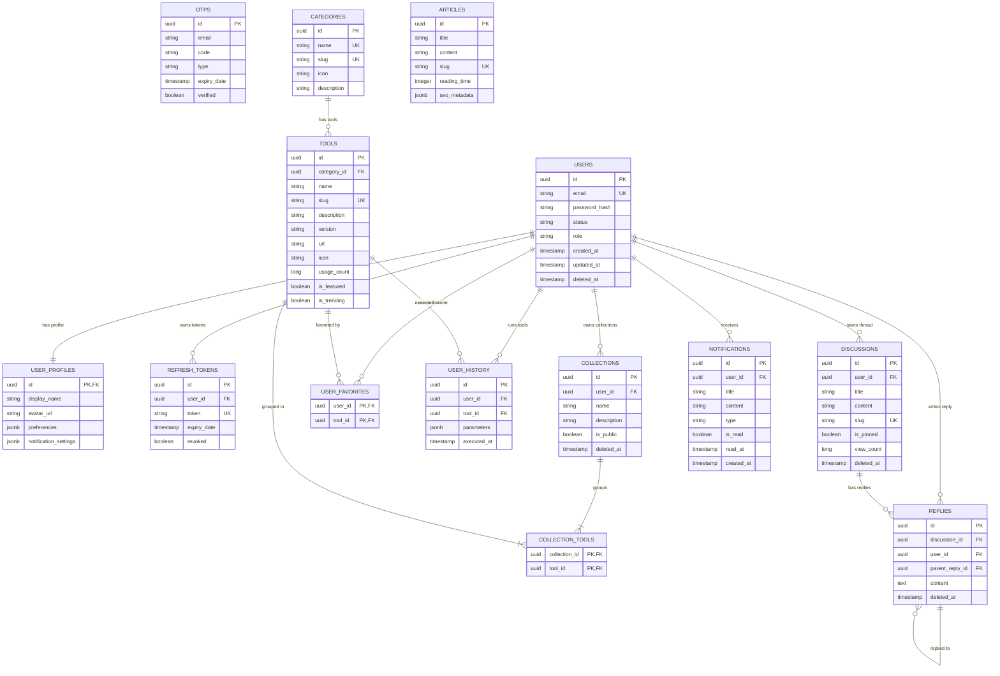

# Acklet Backend Architecture Reference

> **Related Documents**:
> - [Information Architecture](Information-Architecture.md)
> - [Design System](Design-System.md)
> - [Product Experience System](Product-Experience-System.md)

---

## 1. System Architecture & Package Strategy

Acklet follows a **Clean Architecture** organized with a **feature-first package structure**. Rather than grouping code by technical roles (e.g., controllers, services, repositories), the codebase is organized by business domain features. Each module maintains its own controller, service, repository, entity, and DTO layers.

```
com.code.acklet/
│
├── shared/                 # Cross-cutting platform concerns
│   ├── config/             # Auditing and DB configurations
│   ├── dto/                # Standardized response structures
│   ├── entity/             # Mapped superclass definitions
│   ├── exception/          # Global exception handler & custom exceptions
│   ├── logging/            # MDC Correlation filters
│   └── security/           # Stateless JWT configurations & BCrypt encoders
│
├── auth/                   # Authentication & Session Gateways
├── user/                   # User Profiles, Preferences & Settings
├── tool/                   # Logical tool categories & execution catalog
├── collection/             # User-curated custom tool collections
├── notification/           # In-app event log notifications
├── community/              # Forum threads & comments discussion board
├── blog/                   # Technical blog posts & tutorials
└── search/                 # Omnisearch autocomplete query engine
```

### Decoupling with Spring Application Events
To avoid circular dependencies between packages, modules communicate asynchronously using standard Spring events:
- **`UserRegisteredEvent`**: Published when a user registers; handled by `NotificationService` to log OTPs and queue verification messages.
- **`EmailVerifiedEvent`**: Published when a user completes email validation; triggers welcome notifications.

---

## 2. Database Schema (PostgreSQL Entity Relationship)

Primary keys are modeled using secure UUIDs. Auditing columns (`createdAt`, `updatedAt`, `createdBy`, `updatedBy`, `deletedAt` for soft-deletes) are handled automatically by Spring Data JPA through `Auditable`.



---

## 3. Platform Technical Details

### A. Standard API Response Structure
Every REST response follows the unified shape (`ApiResponse`):
```json
{
  "success": true,
  "message": "Operation description",
  "data": {},
  "meta": {},
  "timestamp": "2026-07-16T14:00:00.000Z",
  "traceId": "9f3c78a0-bb65-4f32-8ea1-cf378bdc9a20"
}
```

### B. Exception Mapping & Safety
Uncaught exceptions are serialized safely. Form validation errors (Bean Validation) report key-value fields containing localized messages:
```json
{
  "success": false,
  "message": "Validation failed",
  "data": {
    "email": "Please provide a valid email address",
    "password": "Password must be between 8 and 100 characters"
  },
  "meta": null,
  "timestamp": "2026-07-16T14:01:00Z",
  "traceId": "9f3c78a0-bb65-4f32-8ea1-cf378bdc9a20"
}
```

### C. Logging & Correlation ID
A servlet filter intercepting incoming calls appends `X-Correlation-ID` to the MDC context, outputting log statements in the format:
`2026-07-16 14:02:00.000 [9f3c78a0-bb65-4f32-8ea1-cf378bdc9a20] INFO com.code.acklet.auth.service.AuthService - User registered: email@example.com`

---

## 4. API Endpoint Index

### Authentication Gateway (`/api/v1/auth`)
- `POST /register`: Create account. Sends email OTP.
- `POST /login`: Generate JWT access token & persistent refresh token.
- `POST /refresh`: Rotate refresh token to issue a new Access/Refresh token pair.
- `POST /verify-email`: Validates verification code to activate account.
- `POST /resend-otp`: Regenerate verification OTP code.
- `POST /forgot-password`: Generates reset code for password recovery.
- `POST /reset-password`: Validates code and overwrites account password.
- `POST /logout`: Invalidate refresh token session.

### Users Service (`/api/v1/users`)
- `GET /me`: Fetch active user profile, theme preferences, and notifications settings.
- `PUT /me/profile`: Update display name and avatar URL.
- `PUT /me/preferences`: Update client UI options (e.g. default keybindings, visual modes).
- `PUT /me/notifications`: Change default channel dispatch rules.

### Tools catalog (`/api/v1/tools` & `/api/v1/categories`)
- `GET /categories`: List tool categories.
- `GET /categories/{slug}`: Specific category properties.
- `GET /categories/{slug}/tools`: Paginated tools in specific category.
- `GET /tools`: Keyword search catalog tools (filters slug, tags).
- `GET /tools/{slug}`: Specific tool details (sandbox sandbox config).
- `GET /tools/featured`: Featured developer utilities.
- `GET /tools/trending`: Highest-run tools list.
- `GET /tools/new-releases`: List newly released tools.
- `POST /tools/{id}/use`: Track tool execution stats.

### Collections (`/api/v1/collections`)
- `GET /collections/public`: Retrieve public playlists.
- `GET /collections/me`: Retrieve collections owned by logged-in user.
- `GET /collections/{id}`: Detailed view of tools inside a collection (enforces private ownership constraints).
- `POST /collections`: Create a new custom collection of tools.
- `PUT /collections/{id}`: Update collection contents or set visibility.
- `DELETE /collections/{id}`: Soft-delete collection.

### Notifications (`/api/v1/notifications`)
- `GET /notifications`: Paginated list of notifications.
- `GET /notifications/unread-count`: Number of unread alerts.
- `PUT /notifications/{id}/read`: Mark specific notification as read.
- `PUT /notifications/read-all`: Mark all notifications as read.

### Discussions Board (`/api/v1/community`)
- `GET /community/discussions`: Browse forum threads.
- `GET /community/discussions/{slug}`: Thread details and increments view counters.
- `POST /community/discussions`: Start a discussion.
- `DELETE /community/discussions/{id}`: Delete discussion (verifies ownership or ADMIN/MOD status).
- `GET /community/discussions/{id}/replies`: Fetch replies tree.
- `POST /community/discussions/{id}/replies`: Append a reply or reply to an existing comment.
- `DELETE /community/replies/{id}`: Delete comment.

### Blog & Insights (`/api/v1/blog`)
- `GET /blog`: Fetch article list.
- `GET /blog/{slug}`: Detailed article content with reading-time stats.
- `POST /blog`: Publish new article (requires `ROLE_ADMIN`).
