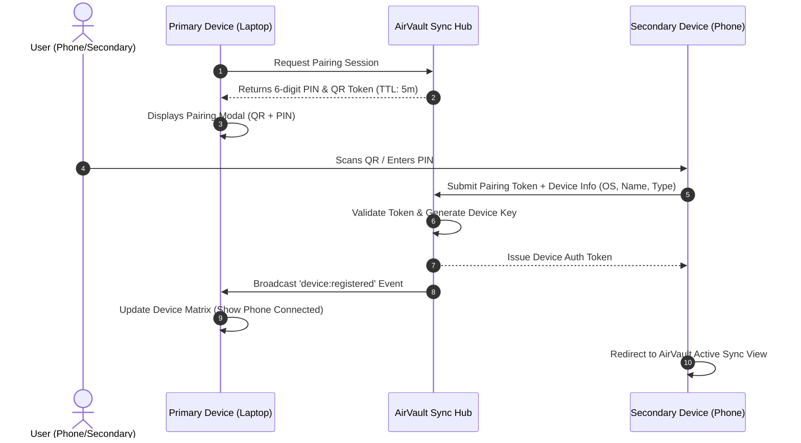
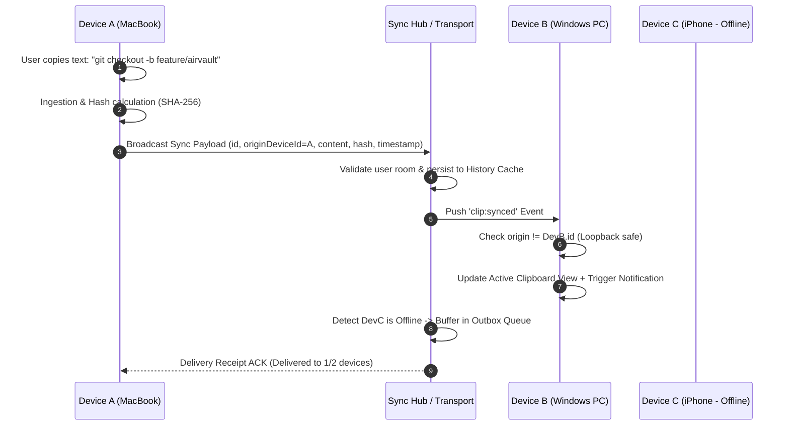
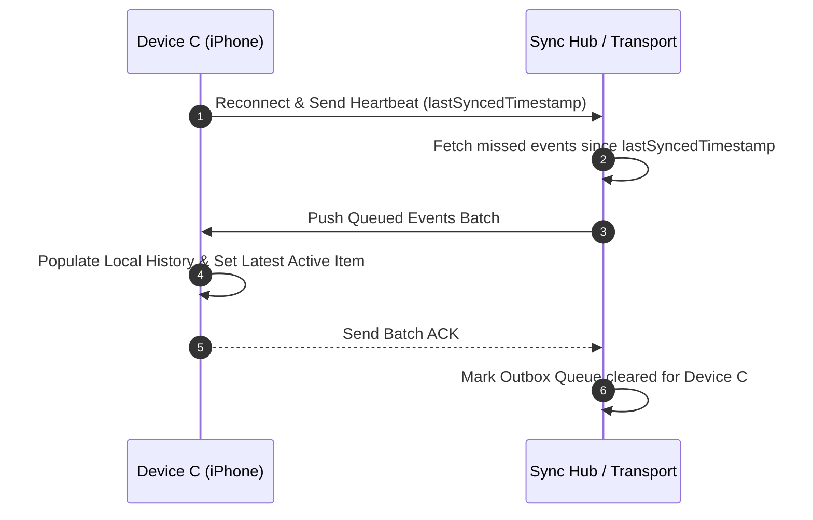
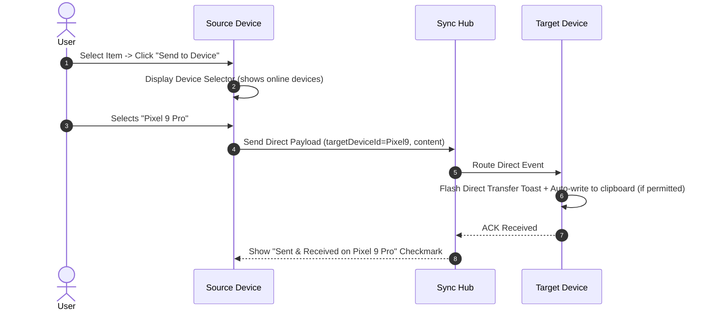
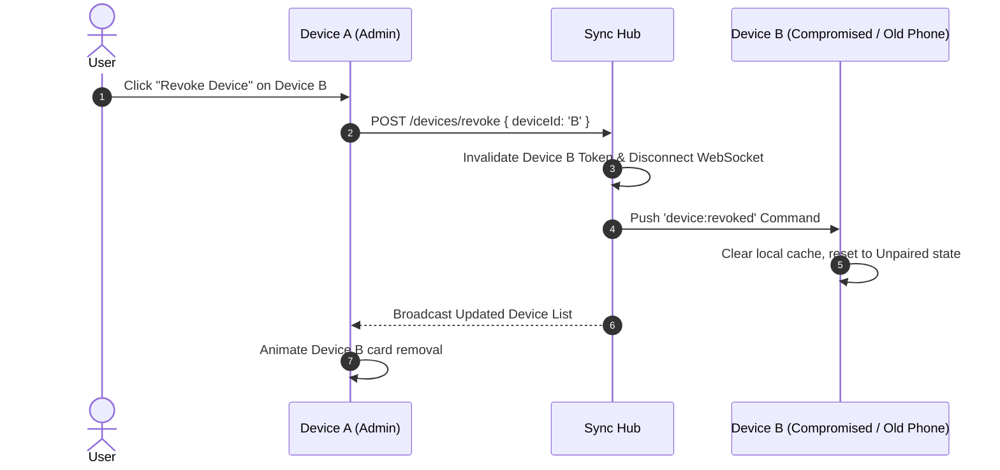

# AirVault — End-to-End User Flows

## Flow A: Connect & Pair a New Device

---

## Flow B: Automatic Clipboard Copy & Synchronize

---

## Flow C: Device Reconnection & Outbox Flush

---

## Flow D: Manual Targeted Transfer to Device

---

## Flow E: Revoke / Disconnect a Device

